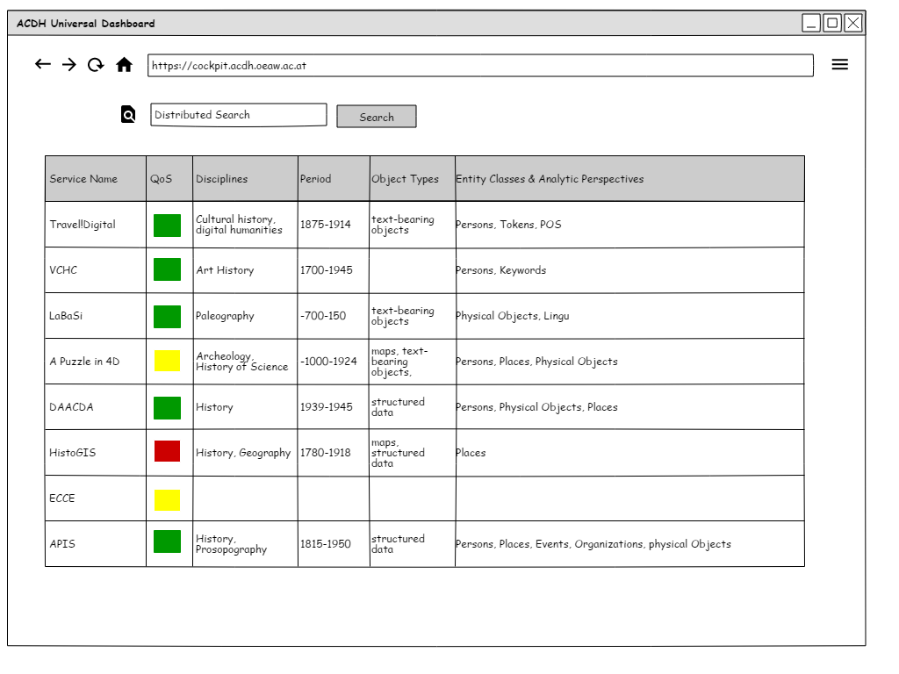
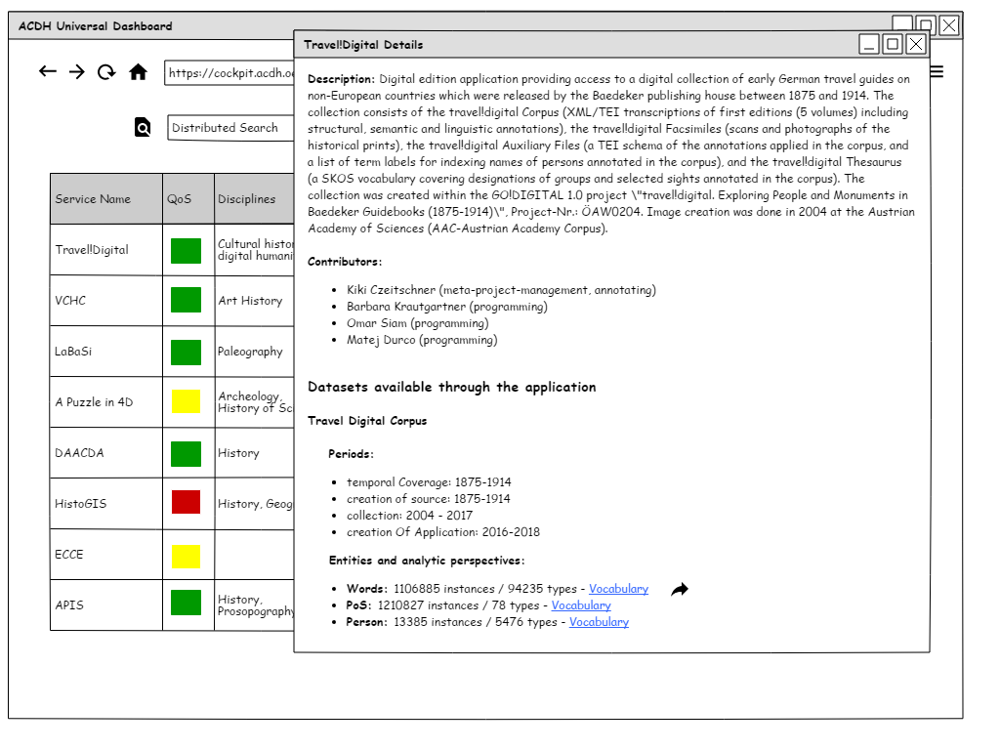

# Universal Dashboard

Prelimenary Results of the Working Group on specifying a [Dashbord](https://docs.google.com/document/d/1zlGto-YcIdkURahGufwL3s_ovhf-fgfveTF0CjY1p4U/edit#heading=h.h98t33ujog7h) of ACDH-Applications and Services

## Schema for Self Application Self Description

forthcoming - draft [here](Schema_Samples/template.json)

## Data Sources + Mappings

| field path          | source  | source path                  |
| ------------------- | ------- | ---------------------------- |
| meta.ID             | redmine | issue.id                     |
| meta.uris.selfDesc  | redmine | to be created                |
| meta.uris.frontPage | redmine | issue.custom_fields[2].value |
| meta.title          | redmine | issue.project.name           |

## Mockups

